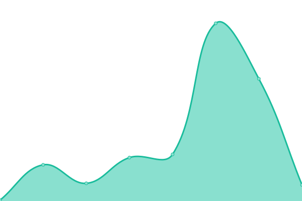
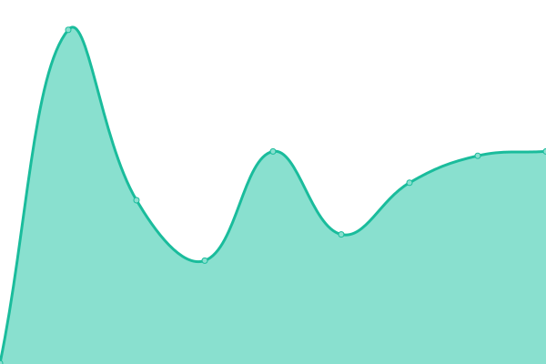
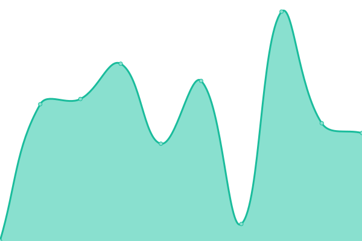
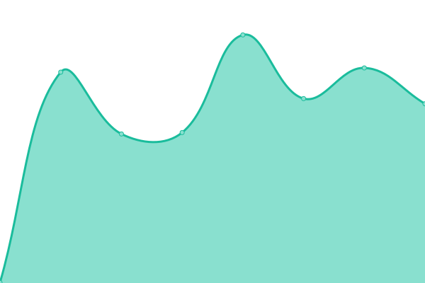
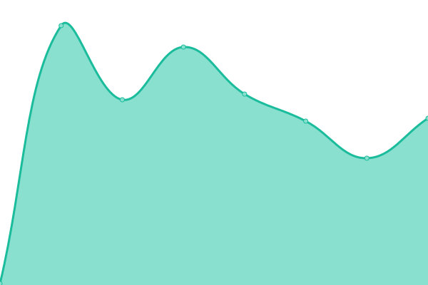
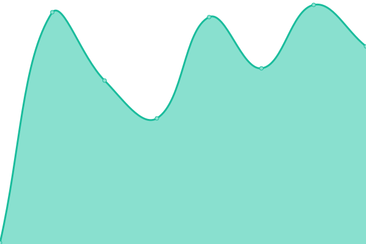

# [📈 Live Status](https://demo.upptime.js.org): <!--live status--> **🟧 Partial outage**

This repository contains the open-source uptime monitor and status page for [No Clocks, LLC](https://website.noclocks.dev), powered by [Upptime](https://github.com/upptime/upptime).

With [Upptime](https://upptime.js.org), you can get your own unlimited and free uptime monitor and status page, powered entirely by a GitHub repository. We use [Issues](https://github.com/noclocks/uptime/issues) as incident reports, [Actions](https://github.com/noclocks/uptime/actions) as uptime monitors, and [Pages](https://demo.upptime.js.org) for the status page.

<!--start: status pages-->
<!-- This summary is generated by Upptime (https://github.com/upptime/upptime) -->
<!-- Do not edit this manually, your changes will be overwritten -->
<!-- prettier-ignore -->
| URL | Status | History | Response Time | Uptime |
| --- | ------ | ------- | ------------- | ------ |
|  [Domain](https://noclocks.dev) | 🟩 Up | [domain.yml](https://github.com/noclocks/uptime/commits/HEAD/history/domain.yml) | 

 571ms
     
 | 

<a href="https://noclocks.github.io/uptime/history/domain">100.00%</a>
    

|  [Website](https://noclocks.dev) | 🟩 Up | [website.yml](https://github.com/noclocks/uptime/commits/HEAD/history/website.yml) | 

 82ms
     
 | 

<a href="https://noclocks.github.io/uptime/history/website">100.00%</a>
    

|  [Online Store](https://store.noclocks.dev) | 🟩 Up | [online-store.yml](https://github.com/noclocks/uptime/commits/HEAD/history/online-store.yml) | 

 229ms
     
 | 

<a href="https://noclocks.github.io/uptime/history/online-store">99.82%</a>
    

|  [Development Store](https://devstore.noclocks.dev) | 🟥 Down | [development-store.yml](https://github.com/noclocks/uptime/commits/HEAD/history/development-store.yml) | 

 240ms
     
 | 

<a href="https://noclocks.github.io/uptime/history/development-store">100.00%</a>
    

|  [Blog](https://blog.noclocks.dev) | 🟩 Up | [blog.yml](https://github.com/noclocks/uptime/commits/HEAD/history/blog.yml) | 

 266ms
     
 | 

<a href="https://noclocks.github.io/uptime/history/blog">100.00%</a>
    

|  [Medium](https://medium.noclocks.dev/) | 🟩 Up | [medium.yml](https://github.com/noclocks/uptime/commits/HEAD/history/medium.yml) | 

 825ms
     
 | 

<a href="https://noclocks.github.io/uptime/history/medium">100.00%</a>
    

|  [Testimonials](https://testimonials.noclocks.dev) | 🟩 Up | [testimonials.yml](https://github.com/noclocks/uptime/commits/HEAD/history/testimonials.yml) | 

 439ms
     
 | 

<a href="https://noclocks.github.io/uptime/history/testimonials">100.00%</a>
    

|  [EnvShare](https://envshare.noclocks.dev) | 🟩 Up | [env-share.yml](https://github.com/noclocks/uptime/commits/HEAD/history/env-share.yml) | 

 117ms
     
 | 

<a href="https://noclocks.github.io/uptime/history/env-share">100.00%</a>
    

|  [DevDocs (Demo)](https://devdocs.noclocks.dev) | 🟩 Up | [dev-docs-demo.yml](https://github.com/noclocks/uptime/commits/HEAD/history/dev-docs-demo.yml) | 

 183ms
     
 | 

<a href="https://noclocks.github.io/uptime/history/dev-docs-demo">100.00%</a>
    

<!--end: status pages-->

[**Visit our status website →**](https://docs.noclocks.dev/uptime)

## 📄 License

- Powered by: [Upptime](https://github.com/upptime/upptime)
- Code: [MIT](./LICENSE) © [Anand Chowdhary](https://anandchowdhary.com), supported by [Pabio](https://pabio.com)
- Data in the `./history` directory: [Open Database License](https://opendatacommons.org/licenses/odbl/1-0/)
